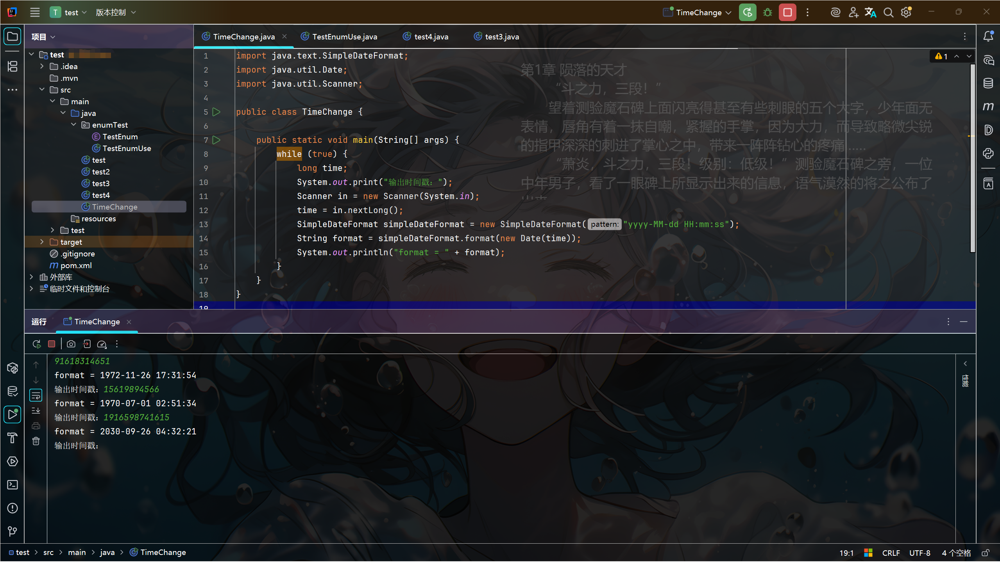

# 摸鱼阅读器 (Novel Reader)

一款专为"摸鱼"场景设计的轻量级本地小说阅读器，基于 Tauri + Vue 3 开发。支持窗口透明、老板键、自定义快捷键等特色功能，让你在工作间隙也能享受阅读的乐趣。


## 特色功能

- 🎭 **窗口透明** - 支持背景透明度调节，可透视桌面或其他窗口
- 🚨 **老板键** - 一键隐藏/最小化窗口，快速切换
- ⌨️ **自定义快捷键** - 所有操作均可自定义快捷键
- 📖 **智能章节识别** - 自动识别多种章节格式
- 💾 **阅读进度记忆** - 自动保存阅读位置，下次打开继续阅读
- 🎨 **高度可定制** - 字体、颜色、间距等均可自由调整
- 🪟 **无边框窗口** - 简洁美观，可自由调整大小

## 功能详解

### 📚 书架管理

| 功能 | 说明 |
|------|------|
| 导入小说 | 支持导入 `.txt` 格式的小说文件 |
| 书籍列表 | 显示所有已导入的书籍，包含书名和章节数 |
| 删除书籍 | 支持删除单本书籍（同时删除本地缓存文件） |
| 清除缓存 | 一键清除所有已导入的小说文件 |

### 📖 阅读功能

| 功能 | 说明 |
|------|------|
| 章节导航 | 左侧滑出式章节目录，支持快速跳转 |
| 上/下一章 | 支持按钮点击和快捷键切换章节 |
| 翻页 | 支持 Page Up / Page Down 快速翻页 |
| 进度保存 | 自动记录当前章节和滚动位置 |

### ⚙️ 设置选项

#### 字体设置

| 设置项 | 范围/选项 | 默认值 |
|--------|----------|--------|
| 字体大小 | 12px - 32px | 18px |
| 字体类型 | 宋体、黑体、楷体、微软雅黑、系统默认 | 微软雅黑 |
| 字体粗细 | 正常、加粗 | 正常 |
| 行间距 | 1.0 - 3.0 | 1.8 |
| 段落间距 | 0px - 30px | 15px |

#### 颜色设置

| 设置项 | 预设选项 | 默认值 |
|--------|----------|--------|
| 背景颜色 | 米白、护眼绿、淡黄、浅灰、纯白、深灰、纯黑 + 自定义 | 米白 (#F5F5DC) |
| 字体颜色 | 黑色、深灰、中灰、浅灰、白色、深蓝、深绿 + 自定义 | 深灰 (#333333) |

#### 透明度设置

| 设置项 | 范围 | 说明 |
|--------|------|------|
| 背景透明度 | 0% - 100% | 控制整体窗口背景的透明程度 |
| 字体透明度 | 0% - 100% | 控制文字的透明程度 |

> 💡 **提示**：将背景透明度调低可以透视到桌面或其他窗口，适合"摸鱼"场景

### ⌨️ 快捷键

| 功能 | 默认快捷键 | 说明 |
|------|-----------|------|
| 上一章 | `←` (左方向键) | 切换到上一章节 |
| 下一章 | `→` (右方向键) | 切换到下一章节 |
| 老板键 | `Esc` | 最小化窗口 |
| 透明切换 | 未绑定 | 快速切换透明/不透明状态 |
| 向上翻页 | `Page Up` | 向上滚动一屏 |
| 向下翻页 | `Page Down` | 向下滚动一屏 |

> 所有快捷键均可在设置面板的「快捷键绑定」中自定义修改

### 📑 章节识别规则

软件支持自动识别以下章节标题格式：

| 格式类型 | 示例 |
|----------|------|
| 中文数字 | `第一章`、`第十二章`、`第一百章` |
| 阿拉伯数字 | `第1章`、`第12章`、`第100章` |
| 英文格式 | `Chapter 1`、`Chapter 12` |
| 纯数字 | `001 标题`、`1. 标题`、`1、标题` |
| 卷+章节 | `第一卷 第一章` |

> 章节目录中的序号会根据章节标题自动提取，无法识别的章节（如"序章"、"作者的话"）显示为 ★

## 文件存储

### 小说文件存储位置

导入的小说文件会复制到应用数据目录：

```
Windows: C:\Users\<用户名>\AppData\Roaming\com.mrl.novel-reader\books\
```

### 配置数据存储

用户设置、书籍信息、阅读进度等数据存储在浏览器的 `localStorage` 中：

| 存储键 | 内容 |
|--------|------|
| `novel_reader_books` | 书籍列表信息 |
| `novel_reader_settings` | 阅读器设置 |
| `novel_reader_progress` | 阅读进度 |
| `novel_reader_keybindings` | 快捷键配置 |

## 导入文件规范

### 支持的文件格式

- **格式**：`.txt` 纯文本文件
- **编码**：UTF-8（推荐）、GBK、GB2312

### 文件要求

1. **文件大小**：建议单个文件不超过 50MB
2. **章节格式**：章节标题需独占一行，符合上述章节识别规则
3. **文件命名**：文件名将作为书籍名称显示

### 示例文件结构

```
第一章 开始的地方

    这是第一章的正文内容...

第二章 新的旅程

    这是第二章的正文内容...
```

## 安装与使用

### 普通用户

直接下载 [Releases](https://github.com/your-username/novel-reader/releases) 页面的安装包：

- **便携版**：下载 `novel-reader.exe`，双击即可运行，无需安装
- **安装版**：下载 `.msi` 或 `.exe` 安装包，安装后使用

> 无需安装任何运行环境，开箱即用！

### 开发者

如果你想参与开发或自行构建，需要以下环境：

#### 环境要求

- **Node.js** 18.x 或更高版本
- **Rust** 1.70 或更高版本
- **Windows 10/11**

#### 安装 Rust

访问 [Rust 官网](https://www.rust-lang.org/learn/get-started) 下载并安装。

Windows 用户下载 `rustup-init.exe` 运行即可。

安装完成后验证：

```bash
rustc --version
```

#### 开发运行

```bash
# 克隆项目
git clone https://github.com/your-username/novel-reader.git

# 进入项目目录
cd novel-reader

# 安装依赖
npm install

# 启动开发服务器
npm run tauri dev
```

#### 构建发布版本

```bash
npm run tauri build
```

构建产物位置：

| 类型 | 路径 |
|------|------|
| 可执行文件 | `src-tauri/target/release/novel-reader.exe` |
| MSI 安装包 | `src-tauri/target/release/bundle/msi/` |
| NSIS 安装包 | `src-tauri/target/release/bundle/nsis/` |

## 技术栈

| 技术 | 用途 |
|------|------|
| [Tauri 2.x](https://tauri.app/) | 桌面应用框架 |
| [Vue 3](https://vuejs.org/) | 前端框架 |
| [Vite](https://vitejs.dev/) | 构建工具 |
| [Vue Router](https://router.vuejs.org/) | 路由管理 |
| localStorage | 本地数据存储 |

## 项目结构

```
novel-reader/
├── src/                          # Vue 前端代码
│   ├── views/                    # 页面组件
│   │   ├── BookShelf.vue         # 书架页面
│   │   └── Reader.vue            # 阅读器页面
│   ├── components/               # 通用组件
│   │   ├── BookCard.vue          # 书籍卡片
│   │   ├── ChapterNav.vue        # 章节导航
│   │   ├── SettingsPanel.vue     # 设置面板
│   │   ├── KeyBindingsPanel.vue  # 快捷键设置
│   │   └── TitleBar.vue          # 自定义标题栏
│   ├── utils/                    # 工具函数
│   │   ├── constants.js          # 常量配置
│   │   ├── fileParser.js         # 文件解析
│   │   ├── chapterDetector.js    # 章节识别
│   │   └── storage.js            # 数据存储
│   ├── router/                   # 路由配置
│   │   └── index.js
│   ├── App.vue                   # 主组件
│   └── main.js                   # 入口文件
├── src-tauri/                    # Tauri 后端代码
│   ├── src/
│   │   └── main.rs               # Rust 主程序
│   ├── icons/                    # 应用图标
│   └── tauri.conf.json           # Tauri 配置
├── package.json                  # npm 依赖配置
└── README.md                     # 项目说明
```

## 使用截图




## 常见问题

### Q: 导入的小说乱码怎么办？

A: 请确保小说文件编码为 UTF-8。可以使用记事本打开文件，另存为时选择 UTF-8 编码。

### Q: 章节识别不正确怎么办？

A: 请检查小说的章节标题格式是否符合识别规则。章节标题需要独占一行，且符合常见的章节命名格式。

### Q: 如何完全卸载？

A:
1. 删除应用程序
2. 删除数据目录：`C:\Users\<用户名>\AppData\Roaming\com.mrl.novel-reader\`
3. 清除浏览器 localStorage（可选）

### Q: 支持 macOS / Linux 吗？

A: 目前仅在 Windows 上测试，理论上 Tauri 支持跨平台，但可能需要调整部分代码。

## 后续计划

- [ ] 全文搜索功能
- [ ] 书签管理
- [ ] 阅读统计
- [ ] 多主题支持
- [ ] macOS / Linux 支持
- [ ] 自动更新功能

## 贡献指南

欢迎提交 Issue 和 Pull Request！

1. Fork 本仓库
2. 创建特性分支：`git checkout -b feature/your-feature`
3. 提交更改：`git commit -m 'Add some feature'`
4. 推送分支：`git push origin feature/your-feature`
5. 提交 Pull Request

## 许可证

本项目基于 [MIT License](LICENSE) 开源。

## 致谢

感谢所有为本项目提供建议和反馈的用户！

---

**免责声明**：本软件仅供学习交流使用，请勿用于任何商业用途。请在工作之余合理使用，注意劳逸结合。
